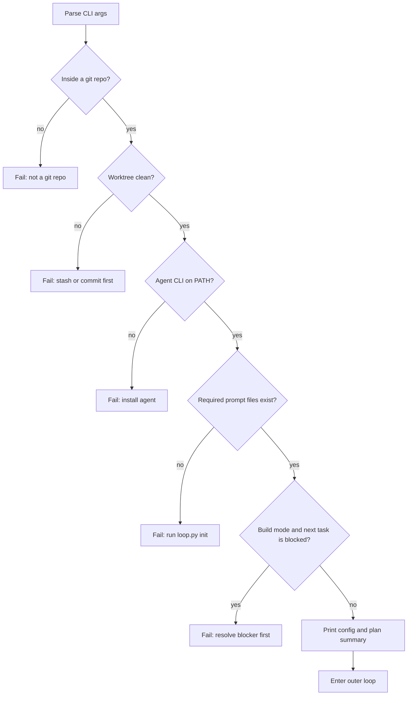
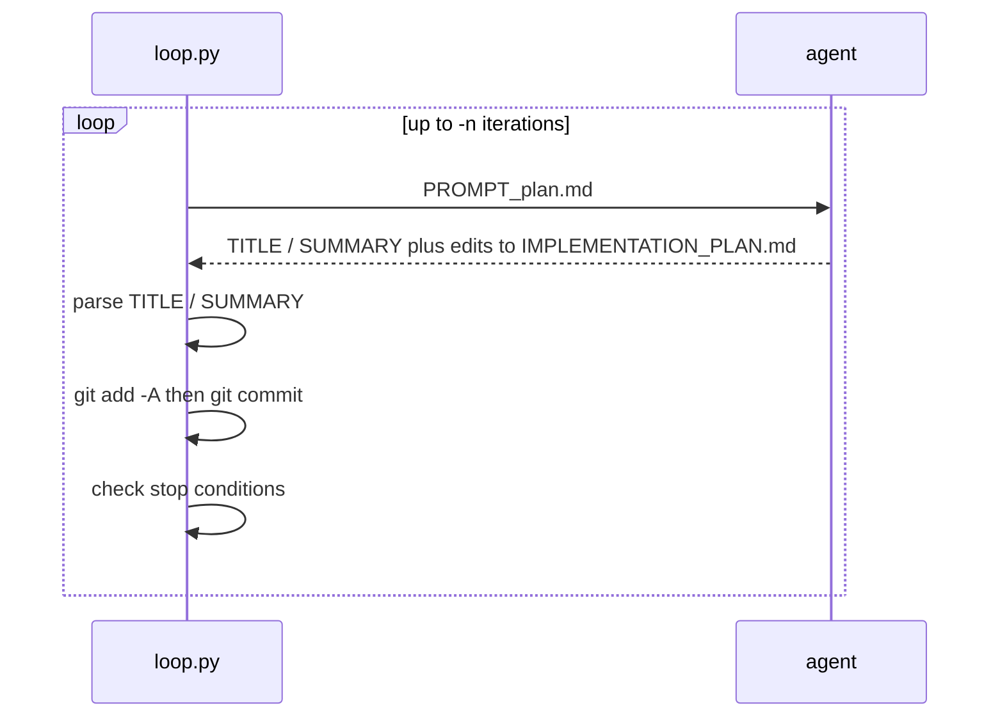
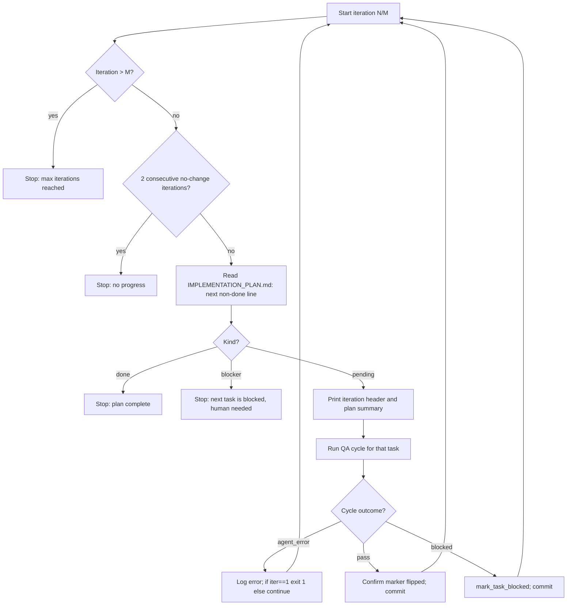
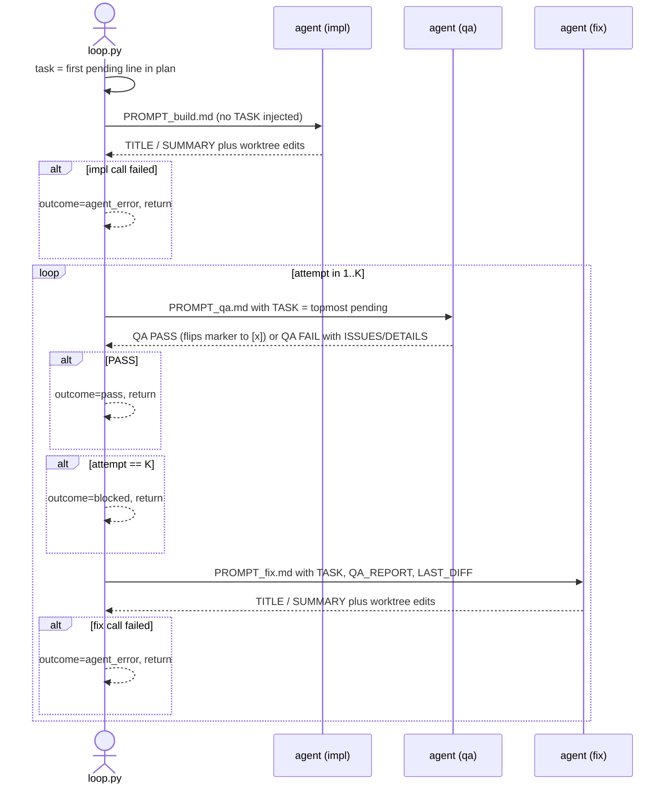

# The Ralph Wiggum Loop — full process

This document describes everything that happens when you run `loop.py`. It covers the three subcommands (`init`, `plan`, `build`), the orchestrated QA cycle that drives build mode, how state flows between calls, what each artifact is, and the conditions that end a run.

The agent backend is selectable via `--agent {claude,pi}`. Both agents go through the same orchestration.

## 1. CLI surface

```
loop.py init
loop.py plan  [-n N] [--model M] [--agent {claude,pi}]
loop.py build [-n N] [--model M] [--agent {claude,pi}] [--qa-max-attempts K]
```

| Flag | Default | Effect |
| --- | --- | --- |
| `-n / --max-iterations` | plan: 10, build: 20 | Cap on outer iterations |
| `--model` | plan: opus, build: sonnet | Model name passed to the agent CLI |
| `--agent` | claude | Which agent CLI to invoke (`claude` or `pi`) |
| `--qa-max-attempts` (build only) | 3 | Per-task: max impl+fix attempts before marking `- [B]`. Minimum 1 |

## 2. Startup: preflight and configuration

Every run (other than `init`) performs preflight checks in order and aborts on the first hard failure:



The **required prompt files** depend on the mode:

| Mode | Files |
| --- | --- |
| `plan` | `PROMPT_plan.md` |
| `build` | `PROMPT_build.md`, `PROMPT_qa.md`, `PROMPT_fix.md` |

The **configuration block** then prints mode, agent, model, branch, HEAD commit, the prompt files in use, the iteration cap, the log directory for this run, and (in build mode) the QA attempts setting.

## 3. `init` mode

`loop.py init` writes the four prompt templates plus the spec template to the current directory and ensures `.ralph/` is in `.gitignore`:

- `PROMPT_build.md`
- `PROMPT_plan.md`
- `PROMPT_qa.md`
- `PROMPT_fix.md`
- `PROMPT_spec.md`

If a file already exists it is overwritten (with a warning).

After `init`, the user is expected to:

1. Review and customise the generated prompts.
2. Populate `specs/` with their application specification.
3. Run `loop.py plan` to produce the initial `IMPLEMENTATION_PLAN.md`.

## 4. `plan` mode

Plan mode is the simple path: each outer iteration is a single agent call.



What the plan agent is told to do:

- Read `specs/*`, the existing `@IMPLEMENTATION_PLAN.md` (if any), and `- [B]` lines in the plan with their attached reasons.
- Produce/update `IMPLEMENTATION_PLAN.md` as a prioritised checkbox list (`- [ ]` pending, `- [x]` done, `- [B] — reason` blocked).
- For each acceptance criterion in the spec, ensure there is a task to add an E2E test if one doesn't already exist.
- Mark anything that needs human intervention as `- [B]`.
- **Sort `- [B]` blocked tasks toward the top of the list where possible** — build mode stops when the next available task is blocked, so frontloading blockers gets them resolved before iteration starts. A `- [B]` that is genuinely non-blocking for everything below it can be left where it is.
- End with `TITLE: …` and `SUMMARY: …` on their own lines.

Plan mode is the only mode that can introduce new `- [B]` entries (alongside build mode's orchestrator-driven blocks). Plan mode never marks `- [x]` — that flip happens only on QA pass in build mode.

## 5. `build` mode

Build mode is the orchestrated path. Each outer iteration handles **one task** end-to-end via the QA cycle, then commits once.

### 5.1 How the orchestrator picks "the task"

The orchestrator walks `IMPLEMENTATION_PLAN.md` top to bottom, looking for the first non-`[x]` line.

- If it is `- [ ]`: that text **is** the task for this iteration. The orchestrator holds onto it as the `{TASK}` placeholder for QA / fix prompts.
- If it is `- [B]`: build stops. The next available task needs human resolution, and skipping past blockers in priority order would diverge from the plan's stated priority.
- If there is no such line: build stops with "all tasks complete".

This convention — *the topmost non-done task is "current"* — replaces the older "agent echoes its task verbatim on a `TASK:` line" contract. Nothing in the prompt schema requires the agent to identify which task it worked on; the orchestrator already knows.

### 5.2 The outer loop



Notes:

- The 2-consecutive-no-change check just counts iterations where nothing got committed. With logs gitignored, "no commit" means the agent literally produced no worktree changes — almost always an upstream error worth bailing on.
- After a PASS, the orchestrator re-reads the plan and verifies that the topmost `- [ ]` is no longer the one it just verified. If the QA agent forgot to flip the marker, the orchestrator flips it itself and emits a loud warning. This is a safety net, not the primary mechanism.

### 5.3 One QA cycle (the inside of "Run QA cycle for that task")



Cycle outcomes:

| Outcome | Meaning |
| --- | --- |
| `pass` | Impl ran, a QA verdict was PASS within the attempt budget. The QA agent flipped the marker to `- [x]` (orchestrator double-checks and flips it if QA missed). |
| `blocked` | QA budget was exhausted with the last verdict still FAIL. The orchestrator flips the marker to `- [B] — <first issue from final QA report>`. |
| `agent_error` | An impl / QA / fix call failed at the CLI level (non-zero exit / no terminal result event). No marker change, no commit; the loop continues to the next iteration (or aborts if this was iteration 1). |

### 5.4 What flows between agents

`run_qa_cycle` keeps **no live session state** between calls. Each agent invocation starts in a fresh context. State flows three ways:

1. **The worktree.** Each call sees the previous call's edits because they are still in the dirty worktree (the cycle does not commit between attempts).
2. **`{TASK}` placeholder, sourced from the plan.** The orchestrator reads the topmost `- [ ]` text once at the start of the iteration and substitutes it into the QA and fix prompts. No agent has to echo anything back.
3. **`{QA_REPORT}` + `{LAST_DIFF}` placeholders.** On a FAIL, the orchestrator passes the QA agent's verbatim output (from the `QA:` line through the end of the message) and the result of `git diff --stat HEAD` into the fix prompt.

This means: anything the QA agent says about *why* it failed is what the fix agent sees as its instructions. The QA prompt's structured `ISSUES:` block is therefore load-bearing — it is the fix agent's todo list, and its first bullet is the `[B] — reason` suffix on a terminal block.

## 6. Per-call artifacts

Every agent call writes its raw stream-JSON output to a per-iteration directory under `.ralph/logs/<run-id>/` (where `<run-id>` is `YYYYMMDD-HHMMSS` of the loop start). `.ralph/` is gitignored.

```
.ralph/logs/<run-id>/
  iter-01/
    impl.jsonl
    qa.1.jsonl
    fix.1.jsonl
    qa.2.jsonl
    commit.txt        ← only written if the iteration produced a commit
  iter-02/
    ...
```

Two things to note:

- All attempts within a cycle are preserved on disk — `qa.1.jsonl` is not overwritten when `qa.2.jsonl` is created.
- Logs are **never committed**. There's no need for a "loop-artifact" filter when checking for substantive progress, and no risk of accidentally committing transcripts that contain secrets, file contents, or tool output.

To watch a call live, `tail -f .ralph/logs/<run-id>/iter-NN/<role>.jsonl` in another terminal. The main loop process itself stays quiet during the call.

To find the logs for a specific commit, either grep `git log` for the iteration number (`Build (NN/MM) - …`) or grep `.ralph/logs/*/iter-*/commit.txt` for the short SHA.

## 7. Plan-file discipline

`IMPLEMENTATION_PLAN.md` has three legitimate writers, each with a tight scope:

| Writer | What it does |
| --- | --- |
| Plan-mode agent (during `plan` runs) | Full edits: priority order, adding/removing tasks, marking `- [B]` for human-required tasks. Never marks `- [x]`. |
| QA agent (on PASS) | Flips the in-flight `- [ ]` line to `- [x]`. Nothing else. May also append new `- [ ]` lines *below* the in-flight task for out-of-scope discoveries. |
| Build / Fix agents | Never edit markers. May append new `- [ ]` lines *below* the in-flight task for discovered scope. |
| Orchestrator | Only writes when QA fails terminally: flips the in-flight `- [ ]` to `- [B] — <reason>`. Also has a safety-net write that flips the in-flight task to `- [x]` if QA returned PASS but didn't flip the marker itself. |

Three rules make this safe:

1. The "in-flight task" is always **the topmost `- [ ]` in the plan**. There is no other handshake — no echo-back, no fuzzy matching.
2. Build / fix / QA agents must never insert new `- [ ]` lines *above* the in-flight task. Doing so would change which task is current.
3. There is no flip-flopping within a cycle. The marker is only ever flipped forward (`- [ ]` → `- [x]` or `- [ ]` → `- [B]`), and only at well-defined points.

## 8. Commit semantics

In build mode the orchestrator commits **once per task** (i.e. once per outer iteration), and only after the entire QA cycle has run. The commit:

- Includes everything in the worktree at the end of the cycle: the (possibly multi-attempt) impl/fix code changes plus the marker flip in `IMPLEMENTATION_PLAN.md`.
- **Does not include** the per-call logs (they live in `.ralph/`, which is gitignored).
- Subject line: `Build (N/M) - <truncated TITLE from impl/fix agent>` (TITLE refreshed if a fix attempt emitted a new one).
- Body has `## Summary`, a one-line `## QA: <outcome> (N attempts, 1 impl + K fix)` header, and `## Metrics` (task progress, duration, agent, model, tokens summed across all calls in the cycle).
- After the commit succeeds, the orchestrator writes `.ralph/logs/<run-id>/iter-NN/commit.txt` containing the short SHA and the subject line.

Plan mode commits once per outer iteration the same way, minus the `## QA` header.

If a cycle ends in `agent_error`, no commit is made — the worktree may still contain partial work, but the loop trusts the user to investigate. (The next iteration will see those files via the dirty-worktree check and abort preflight.)

## 9. Stop conditions

The outer loop exits when any of the following becomes true:

| Condition | Where |
| --- | --- |
| Iteration count exceeds `--max-iterations` | Build + plan |
| 2 consecutive iterations produced no commit (i.e. no worktree changes) | Build + plan |
| The first non-`[x]` line in the plan is `- [B]` | Build only |
| The plan contains no non-`[x]` lines | Build only |
| User sends SIGINT (Ctrl-C) | Any |

On exit, the loop prints a "Loop Complete" banner with total iterations, wall time, summed token usage, final plan status (build mode), HEAD commit, and the run's log directory.
